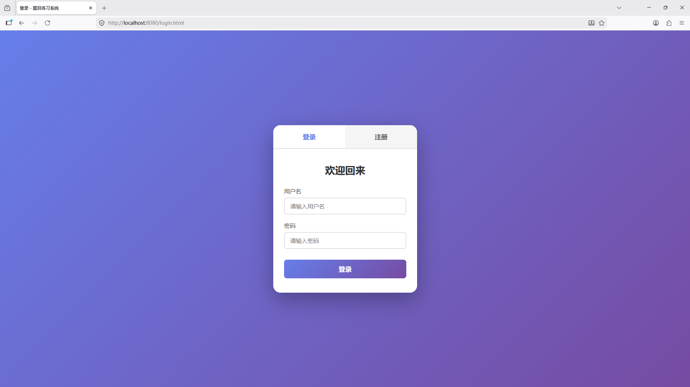
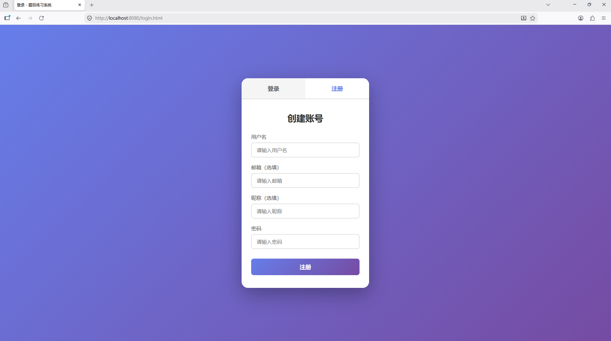
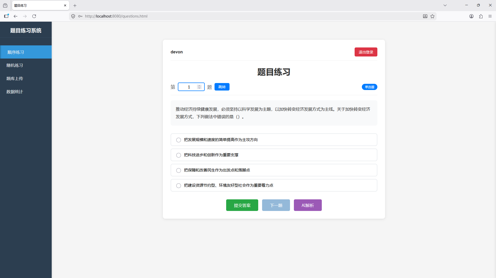
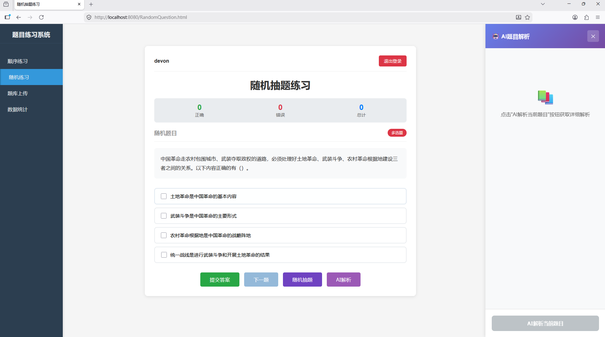
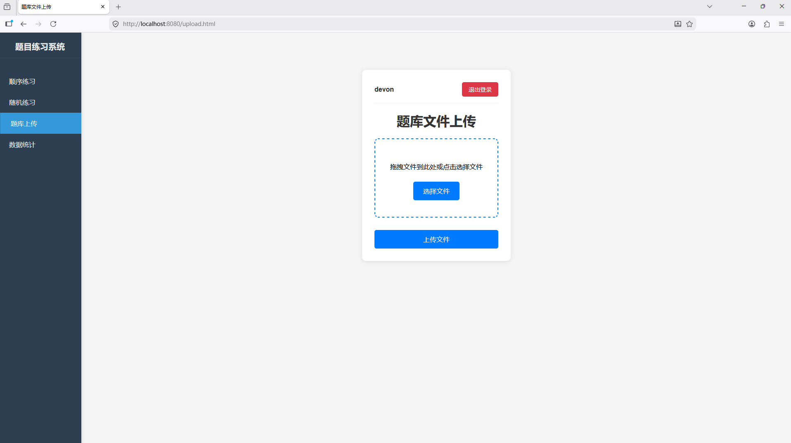
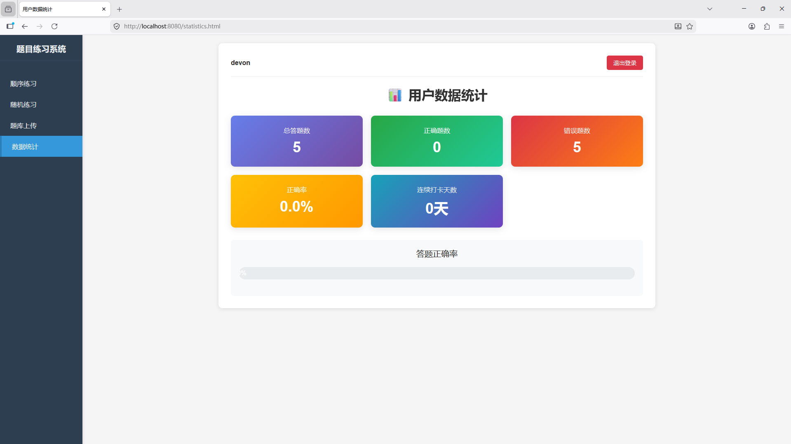

# Moj 题目练习系统

一个功能完善的在线答题学习平台，支持多种题型练习和用户数据统计。

## 项目简介

Moj 是一款轻量级的在线题目练习系统，提供顺序练习、随机抽题、数据统计等功能，帮助用户高效学习和巩固知识。

## 功能特性

### 核心功能

- **用户系统** - 注册、登录、JWT令牌认证
- **顺序练习** - 按题号顺序逐一练习题目
- **随机抽题** - 随机抽取题目进行练习
- **自动判题** - 即时判断答案正确性
- **数据统计** - 记录答题正确率、连续打卡天数
- **题库管理** - 支持JSON格式题库导入
- **AI解析** - 基于AI的题目智能解析

### 题目类型

- 单选题 (singleSelect)
- 多选题 (multipleSelect)
- 判断题 (trueOrFalse)

## 技术栈

### 后端技术

| 技术                  | 说明      |
|---------------------|---------|
| Java 17             | 编程语言    |
| Spring Boot 4.0.5   | Web框架   |
| MyBatis-Plus 3.5.15 | ORM框架   |
| MySQL 8.x           | 数据库     |
| JWT 0.12.5          | 身份认证    |
| LangChain4j 0.36.0  | AI集成    |

### 前端技术

- HTML5 + CSS3 + JavaScript（原生实现，无框架依赖）

## 项目结构

```
Moj/
├── src/main/java/com/devon/moj/
│   ├── controller/          # 控制器层
│   │   ├── AuthController.java      # 认证接口
│   │   ├── QuestionController.java # 题目接口
│   │   ├── AiQuestionController.java# AI接口
│   │   └── UserController.java      # 用户接口
│   ├── service/             # 服务层
│   │   ├── UserService.java
│   │   ├── QuestionShowService.java
│   │   ├── QuestionImportService.java
│   │   └── AiQuestionService.java
│   ├── mapper/              # 数据访问层
│   │   ├── UserMapper.java
│   │   ├── QuestionMapper.java
│   │   ├── UserProgressMapper.java
│   │   └── UserStatisticsMapper.java
│   ├── pojo/                # 数据模型
│   │   ├── User.java
│   │   ├── MaoQuestion.java
│   │   ├── UserProgress.java
│   │   └── UserStatistics.java
│   └── utils/               # 工具类
│       ├── JwtUtil.java
│       └── Result.java
├── src/main/resources/
│   ├── static/              # 前端页面
│   │   ├── login.html
│   │   ├── questions.html
│   │   ├── RandomQuestion.html
│   │   ├── upload.html
│   │   └── statistics.html
│   ├── QuestionBank/        # 题库文件
│   │   ├── maoQuestionsModified.json
│   │   └── xiQuestionsModified.json
│   └── application.yaml     # 配置文件
└── pom.xml                  # Maven配置
```

## API 接口

### 认证接口 `/api/auth`

| 方法   | 路径        | 说明   |
|------|-----------|------|
| POST | /register | 用户注册 |
| POST | /login    | 用户登录 |

### 题目接口 `/api/questions`

| 方法   | 路径      | 说明     |
|------|---------|--------|
| GET  | /{id}   | 获取题目详情 |
| GET  | /count  | 获取题目总数 |
| POST | /judge  | 提交答案判题 |
| POST | /import | 导入题库   |

### 用户接口 `/api/user`

| 方法  | 路径          | 说明       |
|-----|-------------|----------|
| GET | /statistics | 获取用户统计数据 |

## 快速开始

### 环境要求

- JDK 17 或更高版本
- Maven 3.6+
- MySQL 8.x
- Redis

### 配置步骤

1. **创建数据库**

```sql
CREATE DATABASE moj CHARACTER SET utf8mb4 COLLATE utf8mb4_unicode_ci;
```

2. **修改配置文件**
   编辑 `src/main/resources/application.yaml`：

```yaml
spring:
  datasource:
    url: jdbc:mysql://localhost:3306/moj?useUnicode=true&characterEncoding=utf8&serverTimezone=Asia/Shanghai
    username: your_username
    password: your_password

jwt:
  secret: your-256-bit-secret-key-here-must-be-at-least-256-bits-long
```

3. **配置AI功能（可选）**
   设置环境变量：

```bash
export OPENAI_API_KEY=your-openai-api-key
```

### 启动项目

```bash
# 打包项目
mvn clean package

# 运行项目
mvn spring-boot:run

# 或运行jar包
java -jar target/moj-0.0.1-SNAPSHOT.jar
```

访问 `http://localhost:8080` 即可使用系统。

## 题库格式

题库支持JSON格式，示例：

```json
{
  "type": "singleSelect",
  "question": "题目内容",
  "options": [
    "选项A",
    "选项B",
    "选项C",
    "选项D"
  ],
  "answer": "A",
  "analysis": "解析内容（可选）"
}
```

type 可选值：

- `singleSelect` - 单选题
- `multipleSelect` - 多选题
- `trueOrFalse` - 判断题

## 页面截图

以下为各功能页面的效果截图：

### 登录页面



### 注册页面



### 顺序练习页面



### 随机抽题页面



### 题库上传页面



### 数据统计页面



> **截图命名规范**：
> - `login.png` - 登录注册页面
> - `questions.png` - 顺序练习页面
> - `random-question.png` - 随机抽题页面
> - `upload.png` - 题库上传页面
> - `statistics.png` - 数据统计页面

## 页面说明

| 页面                  | 功能      |
|---------------------|---------|
| login.html          | 登录/注册页面 |
| questions.html      | 顺序练习页面  |
| RandomQuestion.html | 随机抽题页面  |
| upload.html         | 题库上传页面  |
| statistics.html     | 数据统评页面  |

## License

本项目仅供学习交流使用。
